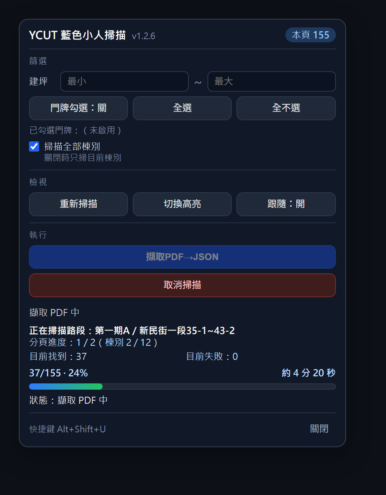

# YCut Extractor

<p align="center">
  
</p>

<p align="center">
  輕量化 Chrome 擴充功能 — 擷取 / 輔助處理指定網頁內容
</p>

<p align="center">
  
  
  
</p>

---

## Screenshot

<p align="center">
  
</p>

---

## Features

- 支援 Chrome Extension Manifest V3
- 透過 `content.js` 注入網頁腳本
- 透過 `popup.html` 提供操作介面
- 使用 `background.js` 處理背景邏輯
- 支援 JSZip 壓縮 / 匯出功能
- 輕量化、免安裝、可直接載入未封裝項目

---

## Tech Stack

| 項目 | 技術 |
|---|---|
| 平台 | Chrome Extension |
| Manifest | Manifest V3 |
| 前端 | HTML / CSS / JavaScript |
| 壓縮處理 | JSZip |
| 背景執行 | Service Worker |
| 設定檔 | manifest.json |

---

## Architecture

```text
YCut-Extractor/
├── manifest.json
├── background.js
├── content.js
├── popup.html
├── popup.js
├── content.css
├── lib/
│   ├── jszip.js
│   └── jszip.min.js
├── icons/
│   └── icon128.png
└── screenshots/
    └── screenshot.png
